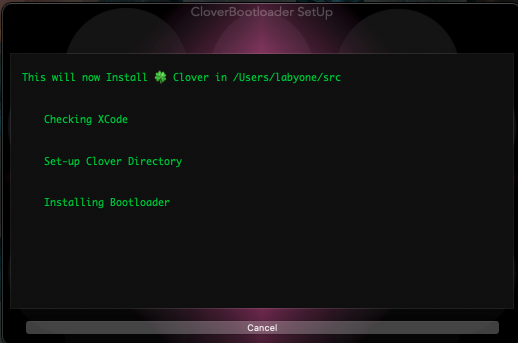

# Clover Setup
Little tool to help install and build the CloverBootloader

From scratch or to replace the source, maintaining your personal settings.

##

##
Version 1.4 

[Download](https://github.com/LAbyOne/Clover-Builder/raw/main/Clover_Setup.dmg)
##
To make sure all will work fine, as first try you should select choice 7 = build all

Otherwise you risk to have some components to fail due to lack of needed files in toolchain.
##
